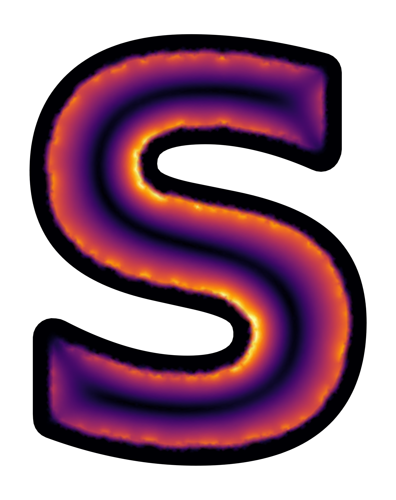

.. SuperScreen documentation master file, created by
   sphinx-quickstart on Fri Jun 18 16:11:42 2021.
   You can adapt this file completely to your liking, but it should at least
   contain the root `toctree` directive.

***********
SuperScreen
***********

.. image:: https://img.shields.io/github/workflow/status/loganbvh/superscreen/lint-and-test/main
   :alt: GitHub Workflow Status (branch)

.. image:: https://readthedocs.org/projects/superscreen/badge/?version=latest
   :target: https://superscreen.readthedocs.io/en/latest/?badge=latest
   :alt: Documentation Status

.. image:: https://codecov.io/gh/loganbvh/superscreen/branch/main/graph/badge.svg?token=XW7LSY8WVD
   :target: https://codecov.io/gh/loganbvh/superscreen
   :alt: Test Coverage

.. image:: https://img.shields.io/github/license/loganbvh/superscreen
   :alt: GitHub

.. image:: https://img.shields.io/badge/code%20style-black-000000.svg
   :target: https://github.com/psf/black

`SuperScreen <https://github.com/loganbvh/superscreen>`_ is an open-source Python package for simulating
the magnetic response of 2D superconductors and multiplanar superconducting devices of arbitrary geometry.
Using a matrix inversion method introduced by Brandt [Brandt-PRB-2005]_, ``SuperScreen`` solves
the coupled London's and Maxwell's equations in and around superconducting films
with spatially-varying penetration depth in the presence of applied magnetic fields
and trapped flux.

``SuperScreen`` can be used to calculate:

- Self- and mutual-inductances in thin film superconducting structures
- Flux-focusing and Meissner screening effects in superconducting devices
- Vector magnetic fields resulting from currents in 2D superconducting structures

Click :ref:`here <background>` to read more about the way ``SuperScreen`` solves
models of superconducting devices.

For quick demonstration of ``SuperScreen``, see the :ref:`quickstart notebook </notebooks/quickstart.ipynb>`.
Better yet, click the badge below to try ``SuperScreen`` interactively online via `Binder <https://mybinder.org/>`_:

.. image:: https://mybinder.org/badge_logo.svg
   :target: https://mybinder.org/v2/gh/loganbvh/superscreen/HEAD?filepath=docs%2Fnotebooks
   :align: center

.. note::

   Binder instances are `limited to 2 GB of memory
   <https://mybinder.readthedocs.io/en/latest/about/about.html#how-much-memory-am-i-given-when-using-binder>`_,
   so you can only solve relatively small models online.

.. toctree::
   :maxdepth: 2
   :caption: Getting Started

   installation.rst
   notebooks/quickstart.ipynb
   background.rst

.. toctree::
   :maxdepth: 2
   :caption: API Reference

   api/device.rst
   api/solve.rst
   api/fem.rst
   api/visualization.rst
   api/sources.rst

.. toctree::
   :maxdepth: 2
   :caption: About SuperScreen

   about/license.rst
   about/contributing.rst
   about/changelog.rst
   about/references.rst

.. Indices and tables
.. ==================

.. * :ref:`genindex`
.. * :ref:`modindex`
.. * :ref:`search`
